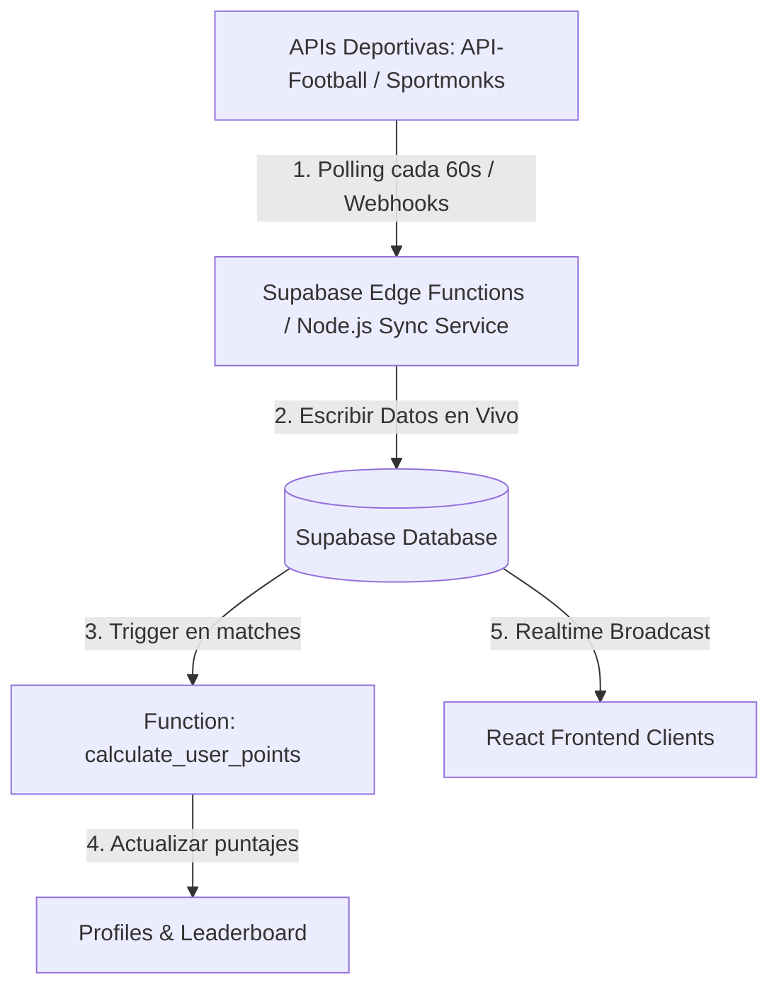

# Auditoría de Ingeniería de Datos y Estrategia de Integración

Este reporte analiza la arquitectura de datos del **World Cup 2026 Ultimate Tracker** bajo la perspectiva de un Data Engineer y diseña una estrategia de integración para conectar la plataforma a APIs deportivas reales.

---

## 1. Análisis del Estado de los Datos

### Datos de Seed Manual
* **Estadios (`stadiums`):** Nombre, ciudad y capacidad de las 16 sedes oficiales de EE. UU., México y Canadá.
* **Grupos (`groups`):** Estructura básica de los 12 grupos oficiales de la Copa del Mundo 2026 (A a L).
* **Equipos (`teams`):** 48 selecciones clasificadas, sus códigos de federación, códigos de bandera, ranking FIFA de referencia e inicialización del continente.
* **Calendario Muestra (`matches`):** Se introdujo una muestra representativa con los primeros 24 partidos correspondientes a la Jornada 1 de la fase de grupos.

### Datos Reales
* **Nombres de Equipos y Códigos:** Información geográfica y federativa fidedigna.
* **Nombres de Estadios y Ciudades:** Ubicaciones y capacidades reales.
* **Ranking FIFA:** Posiciones del ranking FIFA inicial correspondientes al inicio de la Copa del Mundo.

### Datos Ficticios / Mocks
* **Resultados de Partidos:** Los marcadores ingresados en el seed (como `MEX 2 - 1 SRB`) son ficticios y sirven para testear las vistas.
* **Estados de Partidos en Vivo:** Minutos de juego ficticios (`72'`) y estados `'live'` estáticos.
* **Probabilidades de Victoria e IA:** Los porcentajes de probabilidad de victoria (ej. Francia 22.4%) son valores de demostración estáticos embebidos en el frontend.
* **Estadísticas y xG (Expected Goals):** Llenado en frontend mediante datos simulados por falta de registros de eventos en BD.

### Datos Incompletos
* **Calendario Total:** Faltan los 80 partidos restantes del torneo (para completar los 104 totales). Falta la lógica de llaves dinámicas para rondas eliminatorias (dieciseisavos, octavos, cuartos, semifinales y final).
* **Detalle de Eventos:** Falta registrar las incidencias detalladas de los partidos: goleadores, tarjetas amarillas/rojas, alineaciones y sustituciones.
* **Estadísticas Avanzadas:** Sin soporte para métricas clave de simulación (xG, tiros a puerta, posesión por partido, distancias de viaje).

---

## 2. Catálogo de Datos: Fuente Actual vs. Fuente Ideal

| Dato | Tipo de Dato | Estado | Fuente Actual | Fuente Ideal (API Externa) |
| :--- | :--- | :--- | :--- | :--- |
| **Selecciones** | Entidad Base | Completo | Seed manual (`supabase_seed_full.sql`) | API-Football / Sportmonks (ID único del equipo) |
| **Estadios y Ciudades** | Entidad Base | Completo | Seed manual (`supabase_seed_full.sql`) | API-Football / Base de datos estática oficial |
| **Ranking FIFA** | Atributo Equipo | Desactualizado | Estático en tabla `teams` | FIFA API oficial o Endpoint de Rankings en API-Football |
| **Ranking ELO** | Atributo Equipo | Inexistente | No implementado en BD | API externa de Football-Elo o cálculo interno diario vía script de Python |
| **Calendario (Fixture)** | Relación Partido | Incompleto | Seed manual (24 partidos) | API-Football / Sportmonks (104 partidos sincronizados) |
| **Resultados en Vivo** | Transaccional | Mock | Marcadores mock manuales | Live-Score Endpoint de API de Deportes |
| **Alineaciones y Tácticas**| Transaccional | Inexistente | No implementado en BD | Endpoint `/fixtures/lineups` de API-Football |
| **Estadísticas de Juego** | Transaccional | Inexistente | Mocks en Frontend | Endpoint `/fixtures/statistics` (Posesión, tiros, xG) |
| **Probabilidades de IA** | Analítico | Mock | Frontend estático | Motor de Inferencia en Edge Functions (Monte Carlo / Poisson) |
| **Predicciones de Usuarios**| Transaccional | Real | Base de datos (`match_predictions`) | Tabla local en base de datos Supabase (Auth UUID) |

---

## 3. Estrategia de Integración con APIs Deportivas

Para llevar el proyecto a una **Beta Pública** robusta, se propone una arquitectura de integración híbrida basada en eventos y procesos de lote (*Batch*).



### A. Proveedores de API Recomendados

1. **API-Football (RapidAPI) - *Recomendado*:**
   * **Ventajas:** Excelente cobertura de torneos internacionales (incluye Mundiales), coste bajo (plan gratuito de 100 peticiones/día y planes pro competitivos), soporte nativo para estadísticas detalladas, alineaciones y webhooks.
   * **Endpoints clave:**
     * `/fixtures?league=1&season=2026` (Obtener los 104 partidos).
     * `/fixtures/rounds?league=1&season=2026` (Rondas eliminatorias).
     * `/fixtures/statistics?id={id}` (Estadísticas en vivo).

2. **Sportmonks:**
   * **Ventajas:** Extremadamente detallado en datos históricos y xG. Excelente estructuración JSON.
   * **Desventajas:** Mayor coste mensual.

### B. Diseño del Pipeline de Sincronización (Data Pipeline)

Para evitar el consumo excesivo de cuota de API externa y garantizar la consistencia, la sincronización se dividirá en tres flujos:

#### 1. Sincronización de Calendario (Pre-Torneo)
* **Acción:** Ejecutar una tarea programada única para descargar los 104 partidos.
* **Lógica:** Mapear los IDs de la API con los registros de la tabla `matches` de Supabase a través de una columna de referencia `external_id VARCHAR(50)`.
* **Automatización:** Script de sincronización en Node.js/TypeScript corriendo como una Edge Function manual.

#### 2. Sincronización en Tiempo Real (Durante el Torneo)
* **Lógica de Estado:**
  * Si no hay partidos activos: Polling básico cada **1 hora** para detectar cambios de horario.
  * Si hay un partido en juego: Polling intensivo cada **60 segundos** o habilitación de **Webhooks** en API-Football.
* **Flujo de Escritura:**
  * La Edge Function recibe el JSON de la API, limpia las estadísticas y hace un `upsert` en la tabla `matches`.
  * Gracias a **Supabase Realtime**, los clientes conectados vía WebSockets reciben el cambio instantáneamente en su UI (marcador, minuto de juego, estadísticas de posesión).

#### 3. Procesamiento y Cálculo de Puntos (Post-Partido)
* **Evento:** Cuando el estado de un partido cambia a `'finished'` en la base de datos de Supabase, se dispara un trigger de PostgreSQL:
```sql
CREATE OR REPLACE FUNCTION process_match_predictions()
RETURNS TRIGGER AS $$
BEGIN
    IF NEW.status = 'finished' AND OLD.status != 'finished' THEN
        -- Calcular puntos para cada predicción del partido finalizado
        UPDATE match_predictions
        SET points_earned = CASE 
            -- Acierto Exacto (3 Puntos)
            WHEN home_score = NEW.home_score AND away_score = NEW.away_score THEN 3
            -- Acierto de Ganador/Empate pero no marcador exacto (1 Punto)
            WHEN (home_score > away_score AND NEW.home_score > NEW.away_score) OR
                 (home_score < away_score AND NEW.home_score < NEW.away_score) OR
                 (home_score = away_score AND NEW.home_score = NEW.away_score) THEN 1
            -- Fallo (0 Puntos)
            ELSE 0
        END
        WHERE match_id = NEW.id;

        -- Recalcular puntajes globales de perfiles de usuario
        UPDATE profiles p
        SET score = COALESCE((
            SELECT SUM(points_earned) 
            FROM match_predictions mp 
            WHERE mp.user_id = p.id
        ), 0);
    END IF;
    RETURN NEW;
END;
$$ LANGUAGE plpgsql;

CREATE TRIGGER match_finished_trigger
AFTER UPDATE ON matches
FOR EACH ROW
EXECUTE PROCEDURE process_match_predictions();
```

### C. Plan de Mitigación de Riesgos (Resiliencia)
* **API Rate Limiting:** Almacenar en caché las respuestas HTTP y usar colas de reintento si la API devuelve errores `429 Too Many Requests`.
* **Consistencia de Datos:** Todos los cálculos matemáticos (puntajes del predictor, standings de grupos) ocurren en la base de datos (PostgreSQL Functions/Triggers) y nunca en el cliente o servidores efímeros, garantizando que el leaderboard siempre sea consistente y auditable.
